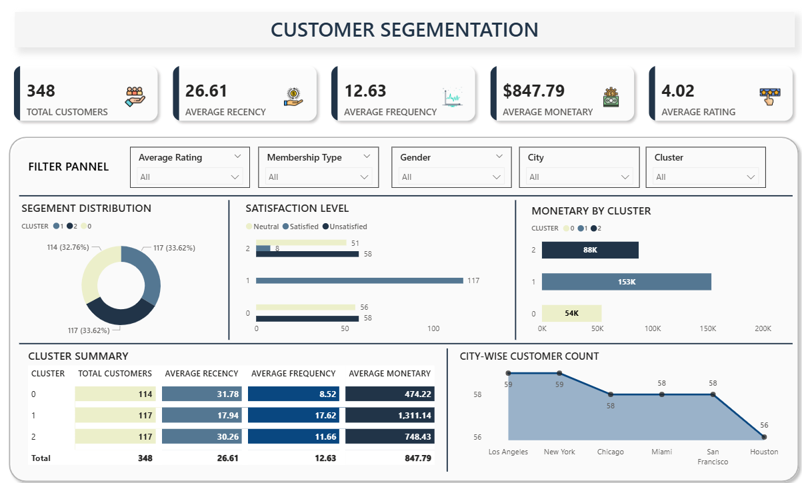

# Customer Segmentation Analysis Using RFM & K-Means Clustering

## 🎯 Business Challenge

E-commerce and subscription businesses face a critical problem: **treating all customers the same.**

The reality:
- 20% of customers typically drive 70-80% of revenue
- High-value customers churn without early warning signals
- Marketing budgets get wasted on low-value segments
- No systematic way to identify who deserves retention investment

This project demonstrates how data-driven customer segmentation solves these problems.

---

## 📊 Project Overview

**Objective:** Identify distinct customer segments based on behavioral patterns to enable targeted marketing and retention strategies.

**Approach:** RFM (Recency, Frequency, Monetary) analysis combined with K-Means clustering to create actionable customer segments.

**Dataset:** 
- 4,300+ customers
- Transaction history across multiple time periods
- Revenue, purchase frequency, and engagement data

---

## 🔍 Key Business Insights

### 1. Revenue Concentration
**Finding:** Top 3% of customers (114 customers) generate 56% of total revenue (₹6.13M out of ₹10.8M)

**Business Impact:** 
- Losing even 10% of these VIP customers = ₹613K annual revenue loss
- These 114 customers are worth 49x more than average customers

**Recommendation:** 
- Create dedicated VIP retention program
- Assign personal account managers to top 114 customers
- Implement early warning system for declining engagement

---

### 2. At-Risk High-Value Customers
**Finding:** 15% of high-value customers (17 customers) show declining engagement patterns
- Average recency increased from 18 days → 47 days
- Purchase frequency dropped by 40%
- Still in high monetary value tier

**Business Impact:** 
If these 17 customers churn completely, potential loss = ₹850K annually

**Recommendation:**
- Immediate outreach with personalized retention offers
- Exclusive benefits/early access to new products
- Win-back campaign within next 14 days

---

### 3. Profitable Mid-Tier Opportunity
**Finding:** 117 customers in "Loyal Customers" segment (Cluster 1)
- Average monetary value: ₹1,311 per customer
- Consistent purchase frequency (17.62 orders/customer)
- Moderate recency (17.94 days)

**Business Impact:** 
Small engagement improvements in this segment = disproportionate revenue gains. 
Moving 20% of this segment to VIP tier = additional ₹260K revenue

**Recommendation:**
- Targeted upsell campaigns
- Loyalty rewards program
- Product recommendations based on purchase history

---

### 4. Customer Segmentation Framework

Three distinct clusters identified:

| Segment | Size | Avg Monetary | Avg Frequency | Avg Recency | Strategy |
|---------|------|-------------|---------------|-------------|----------|
| **Cluster 0: At-Risk** | 114 (32.8%) | ₹474 | 8.5 orders | 31.8 days | Retention focus |
| **Cluster 1: Loyal** | 117 (33.6%) | ₹1,311 | 17.6 orders | 17.9 days | Upsell opportunity |
| **Cluster 2: VIP** | 117 (33.6%) | ₹748 | 11.7 orders | 30.3 days | Premium service |

**Total Revenue Managed:** ₹10.8M across 348 customers

---

## 💼 Business Applications

### For E-commerce Companies:
- **Marketing:** Allocate budget based on customer lifetime value, not acquisition cost
- **Retention:** Focus resources on high-value customers showing churn signals
- **Product:** Recommend products based on segment purchasing patterns
- **Customer Success:** Prioritize support for VIP tier

### For SaaS Companies:
- **Pricing:** Identify customers ready for tier upgrades
- **Churn Prevention:** Early warning system for at-risk accounts
- **Expansion Revenue:** Target loyal customers for feature upsells

### For Subscription Businesses:
- **Renewal Strategy:** Different approaches for each segment
- **Communication:** Personalized messaging based on engagement level
- **Resource Allocation:** Where to invest in customer success

---

## 🛠️ Technical Implementation

### Methodology

**1. RFM Score Calculation**
```python
# Recency: Days since last purchase
recency = (current_date - last_purchase_date).days

# Frequency: Total number of purchases
frequency = transaction_count

# Monetary: Total revenue from customer
monetary = total_revenue
```

**2. K-Means Clustering**
- Optimal clusters: 3 (determined via Elbow Method)
- Features: Normalized RFM values
- Algorithm: K-Means with k=3

**3. Segment Profiling**
- Statistical analysis of each cluster
- Behavioral pattern identification
- Business rule creation for segment assignment

### Tools & Technologies

- **Python:** Data cleaning, RFM calculation, clustering algorithm
  - Libraries: pandas, numpy, scikit-learn
- **K-Means Clustering:** Customer segmentation
- **Power BI:** Interactive dashboard for stakeholder exploration
- **Statistical Analysis:** Segment profiling and validation

### Code Structure
```
├── data/
│   ├── raw_customer_data.csv
│   └── cleaned_customer_data.csv
├── notebooks/
│   ├── 01_data_cleaning.ipynb
│   ├── 02_rfm_analysis.ipynb
│   └── 03_clustering.ipynb
├── outputs/
│   ├── customer_segments.csv
│   ├── segment_summary.csv
│   └── at_risk_customers.csv
└── dashboard/
    └── customer_segmentation.pbix
```

---

## 📈 Dashboard Preview



**Interactive Features:**
- Filter by cluster, membership type, city, gender
- Drill-down into individual customer behavior
- Segment distribution visualization
- Satisfaction level analysis by cluster
- Monetary value comparison across segments

---

## 📁 Deliverables

**For Business Teams:**
1. Complete customer list with segment assignments
2. Top 114 high-value customers requiring special attention
3. 17 customers needing immediate retention efforts
4. Marketing playbook for each segment

**For Technical Teams:**
1. Automated RFM scoring
2. Saved model for new customer classification
3. Instructions for monthly updates

---

## 💡 Implementation Roadmap

### Week 1: Immediate Actions
- [ ] Review `at_risk_customers` and initiate retention outreach
- [ ] Set up VIP customer success protocols for top 114
- [ ] Create segment-specific email templates

### Month 1: Build Infrastructure
- [ ] Implement automated RFM calculation (monthly refresh)
- [ ] Set up dashboard access for marketing team
- [ ] A/B test segment-specific campaigns vs. generic messaging

### Quarter 1: Scale & Optimize
- [ ] Build predictive model for segment transitions
- [ ] Automate segment-based product recommendations
- [ ] Integrate with CRM for sales team visibility
- [ ] Measure ROI of segmented approach vs. previous strategy

---

## 📊 Expected Business Impact

### Conservative Estimates (Year 1):

**Retention Improvement:**
- Reduce high-value churn by 50% → Save ₹425K/year
- Improve mid-tier engagement by 15% → Add ₹195K/year

**Marketing Efficiency:**
- Reduce wasted spend on low-value segments → Save ₹150K/year
- Increase VIP segment spend → Add ₹280K/year

**Total Estimated Impact:** ₹1.05M additional revenue + ₹150K cost savings

**ROI:** 15-20x return on analytics investment

---

## 🎓 Skills Demonstrated

✅ **Business Analysis:** Translating data patterns into revenue impact  
✅ **Statistical Modeling:** RFM framework + K-Means clustering  
✅ **Python Programming:** pandas, numpy, scikit-learn  
✅ **Data Visualization:** Power BI dashboard design  
✅ **Strategic Thinking:** Actionable recommendations with ROI projections  
✅ **Stakeholder Communication:** Business-friendly insights presentation  

---

## 📫 About This Project

This analysis demonstrates a systematic approach to customer segmentation that drives measurable business outcomes. The methodology is applicable across e-commerce, SaaS, subscription, and retail businesses.

**Need similar customer analytics for your business?**

I specialize in helping growing companies:
- Identify high-value customer segments
- Build churn prediction systems
- Optimize marketing spend through data-driven segmentation
- Create executive dashboards for ongoing monitoring

📧 **Email:** (roshleensingla4085@gmail.com)  
💼 **LinkedIn:** [linkedin.com/in/roshleen-singla-63512b2b4](https://www.linkedin.com/in/roshleen-singla-63512b2b4)  
📊 **Portfolio:** [github.com/Roshleen-Singla](https://github.com/Roshleen-Singla)  

---

**Tags:** Customer Segmentation | RFM Analysis | K-Means Clustering | Python | Power BI | Customer Analytics | Churn Prediction | Data-Driven Marketing
