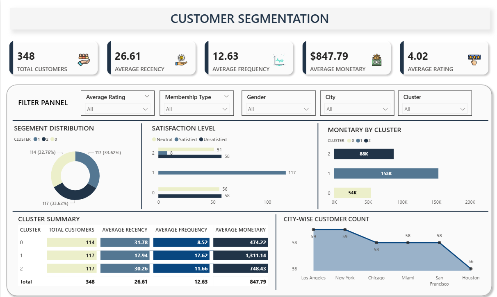

# RFM-based-customer-segmentation-with-Clustering-and-Power-BI
Customer segmentation using RFM analysis and K-Means clustering in Python, visualized with Power BI to uncover actionable marketing insights.

## Tools Used
- Python (Data Cleaning, RFM Calculation)
- K-Means Clustering 
- Power BI (Data Visualization)

## Key Features
- RFM (Recency, Frequency, Monetary) Score Calculation
- K-Means Clustering into 3 customer segments
- Visual segmentation dashboard with filters and insights

## Project Structure
- Cleaned sample dataset
- Python for RFM and clustering
- Final Power BI dashboard screenshot

## Dashboard Preview

## Outcome

- Successfully identified **high-value customers** based on RFM (Recency, Frequency, Monetary) scoring, enabling focused retention strategies.
- Segmented the customer base into distinct groups: **Loyal Customers**, **Dormant Customers**, **At-Risk Customers**, and **New Customers**, using K-Means clustering on RFM values.
- Provided actionable insights through an interactive **Power BI dashboard**, allowing stakeholders to explore customer behavior patterns and segment performance.
- Enabled **data-driven decision making** to optimize marketing efforts, personalize campaigns, and enhance customer engagement based on behavioral clusters.
